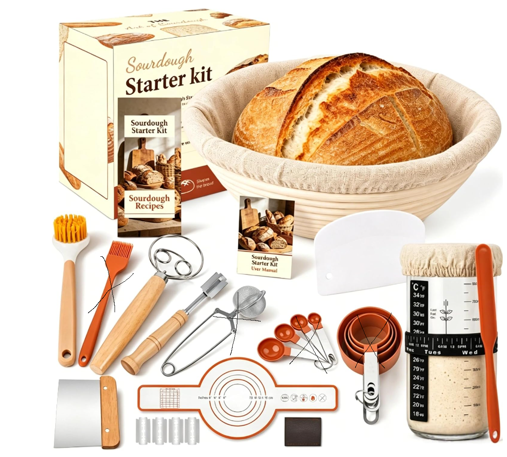
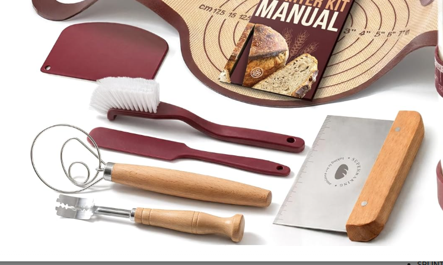
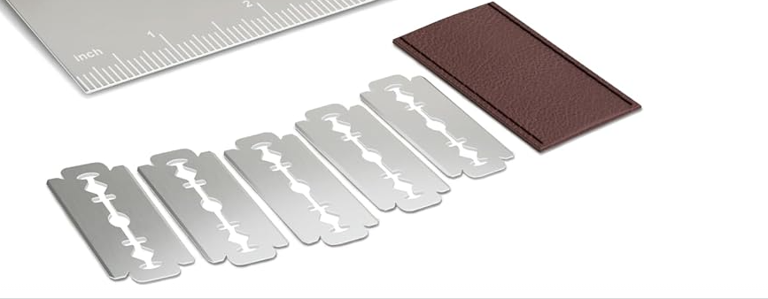

# Sourdough Workflow Guide For Listing Team

## Purpose

This file explains how sourdough starter and sourdough baking work in simple terms, so the listing owner understands what the kit is helping customers do.

The goal is better Amazon listing copy, better image planning, and fewer confusing or misleading claims.

## What Sourdough Is

Sourdough bread is made with a living fermented mixture called a sourdough starter instead of commercial yeast.

A starter is usually made from flour and water. Over time, wild yeast and beneficial bacteria grow inside the mixture. This starter becomes the natural leavening that helps bread rise and gives sourdough its flavor, texture, and crust.

The customer is not just buying tools. They are buying help with a process that can feel confusing at first.

## What A Sourdough Starter Is

A sourdough starter is a living culture made from:

- flour.
- water.
- wild yeast.
- natural bacteria.

The starter must be fed regularly with fresh flour and water. Feeding keeps it active and strong enough to make bread rise.

Important: most sourdough tool kits do not include live starter culture. If our kit does not include live starter, the listing must clearly say that starter culture is not included.

## How A Starter Is Created

Basic beginner process:

1. Mix flour and water in a clean jar.
2. Let it sit loosely covered at room temperature.
3. Feed it daily by removing some starter and adding fresh flour and water.
4. Watch for bubbles, rise, and a pleasant fermented smell.
5. Continue feeding until the starter reliably rises after feeding.

This process can take several days. It is not instant.

Listing implication:

Do not promise instant sourdough success. Instead, promise guidance, organization, and tools that make the process easier to follow.

## Why The Starter Jar Matters

The starter jar is where the customer grows and maintains the sourdough starter.

A good starter jar helps the customer:

- see bubbles and growth.
- track how much the starter rises.
- feed the starter with less mess.
- remember the last feeding day.
- stir and clean the jar more easily.

Useful starter jar features:

- clear glass.
- wide-mouth or funnel-style opening.
- volume markings.
- feeding line markings.
- date/feeding tracker band.
- breathable cloth cover.
- silicone lid for fridge storage.
- silicone base for stability.
- thermometer or temperature strip, if included.

Listing implication:

The jar should be shown as a confidence tool, not just a container.

## Why The Starter Needs Airflow

During active fermentation, starter releases gas. It should usually be loosely covered, not sealed airtight while actively fermenting.

That is why many kits include a cloth cover or breathable lid.

The silicone or solid lid is usually more useful for storage, especially when keeping starter in the fridge.

Listing implication:

Do not tell customers to tightly seal an actively fermenting starter unless the product instructions are designed for that.

## What Happens After The Starter Is Ready

Once the starter is active, the customer uses it to make dough.

The basic bread process:

1. Mix starter, flour, water, and salt.
2. Rest and strengthen the dough.
3. Shape the dough.
4. Proof the dough in a banneton basket.
5. Score the dough with a bread lame.
6. Transfer the dough into hot bakeware.
7. Bake.
8. Cool before slicing.

The kit should support this workflow.

## What Each Main Tool Does

## Visual Kit Contents Reference

Use these images as quick reference while writing the listing. They show the customer what the kit contains and help the team connect each tool to a real step in the sourdough process.

Listing use:

- Use this as the model for the main "complete kit" infographic.
- Clearly label each included item.
- Separate must-have workflow tools from small bonus accessories.

Listing use:

- Use this style for a "tools for every step" image.
- Group the dough whisk, scrapers, brush, and lame as practical workflow tools.
- Avoid making small accessories look like the main reason to buy.

Listing use:

- Show the blade cover and mention safe storage.
- Explain that scoring helps the loaf expand and creates artisan-style designs.
- Include blade caution in the listing and instructions.

Listing use:

- Present stencils as a creative add-on, not a core baking requirement.
- Tie them to gifting, family baking, and decorative finished loaves.

### Starter Jar

Used to create, feed, store, and monitor the sourdough starter.

Listing angle:

"Track your starter's growth and feeding schedule with less guesswork."

### Dough Whisk

Used to mix wet, sticky dough more easily than a regular spoon.

Listing angle:

"Mix thick sourdough dough with less effort."

### Dough Scraper Or Bench Scraper

Used to divide, shape, lift, and move dough on the counter.

Listing angle:

"Handle sticky dough while keeping your work surface cleaner."

### Bowl Scraper

Used to scrape dough from mixing bowls and help fold or transfer dough.

Listing angle:

"Reduce waste and make cleanup easier."

### Banneton Proofing Basket

Used for the final proof. It supports the dough's shape while it rises and can leave classic spiral patterns.

Round baskets make round loaves. Oval baskets make longer oval loaves.

Listing angle:

"Shape beautiful round and oval artisan-style loaves."

### Linen Liners

Placed inside the banneton basket to reduce sticking and make cleanup easier.

Listing angle:

"Washable liners help beginners proof dough with less sticking."

### Bread Lame

A sharp scoring tool used to cut the top of the dough before baking.

Scoring controls where the dough expands in the oven and creates decorative patterns.

Listing angle:

"Score clean lines and create artisan-style designs."

Safety note:

Always mention blade caution and include a blade cover.

### Silicone Bread Sling

Used to lower dough into hot bakeware and lift bread out after baking.

Listing angle:

"Transfer dough more confidently while keeping hands farther from hot bakeware."

### Cleaning Brush

Used to brush dried flour and dough from banneton baskets.

Listing angle:

"Keep baskets clean and ready for the next bake."

### Flour Duster

Used to lightly dust flour on baskets, dough, or stencils.

Listing angle:

"Add even flour dusting for proofing and decoration."

### Stencils

Used with flour to create decorative patterns on the loaf before baking.

Listing angle:

"Create gift-worthy decorative loaves."

### Bread Bags

Used to share or gift finished loaves.

Listing angle:

"Bake, bag, and share homemade sourdough."

## The Real Customer Journey

Most beginner customers feel this:

1. "I want to make sourdough, but I do not know where to start."
2. "I am not sure what tools I need."
3. "I am worried I will mess up the starter."
4. "I want the bread to look beautiful."
5. "I want the process to feel organized."

The listing should answer those concerns clearly.

## How The Kit Should Be Explained

The kit should be presented as a workflow, not as a random pile of tools.

Recommended workflow message:

Starter care -> mixing -> shaping -> proofing -> scoring -> baking transfer -> cleaning -> sharing.

This helps the customer understand why each item is included.

## Claims To Avoid

Avoid these claims unless they are fully true:

- "Starter included" if no live starter culture is included.
- "Perfect bread guaranteed."
- "No-fail sourdough."
- "Professional results every time."
- "Mold-proof" unless validated.
- "Chemical-free" unless confirmed by supplier.
- "Food-safe certified" unless certification exists.
- "App included" unless a real app exists and is maintained.
- "Expert support" unless real support is available.

Better wording:

- "Designed to help beginners start with confidence."
- "Includes the tools and guidance for your first sourdough journey."
- "Helps reduce guesswork from starter care to scoring."
- "Supports beautiful artisan-style loaves at home."

## Listing Image Ideas Based On Workflow

### Image 1: Complete Kit

Show all included parts clearly.

Purpose:

- Prove completeness.
- Reduce confusion.

### Image 2: Starter Care

Show the jar, markings, feeding band, cloth cover, and spatula.

Purpose:

- Explain how starter maintenance works.

### Image 3: Proofing Baskets

Show round and oval baskets with liners and finished loaf shapes.

Purpose:

- Explain why two basket shapes matter.

### Image 4: Mixing And Shaping

Show dough whisk, scraper, and bowl scraper.

Purpose:

- Explain the messy middle of bread making.

### Image 5: Scoring And Decorating

Show bread lame, blades, blade cover, flour duster, and stencils.

Purpose:

- Show creative/artisan outcome.

### Image 6: Baking Transfer

Show silicone bread sling being used to lower dough into bakeware.

Purpose:

- Make the sling feel valuable, not like filler.

### Image 7: Gift And Share

Show finished bread, bread bags, gift box, and gift card if included.

Purpose:

- Connect to gifting and emotional appeal.

## Best Listing Language

Use clear, customer-friendly language:

- "Start your sourdough journey with the tools for every step."
- "Feed your starter, shape your dough, proof your loaf, score your crust, and share the finished bread."
- "A complete kit designed to make sourdough feel approachable from day one."
- "Round and oval baskets help you create two classic loaf shapes."
- "The marked starter jar helps you track growth and feeding."
- "The silicone bread sling helps transfer dough with more confidence."

## Final Guidance For Listing Owner

The listing should make the sourdough process feel understandable.

Do not just say "complete kit." Show why it is complete by connecting each item to a step in the baking journey.

The strongest message is:

This kit guides the customer from starter care to a beautiful finished loaf.
